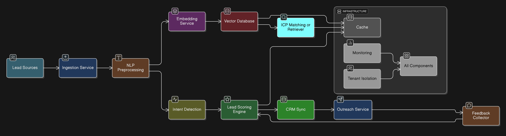

# Scalable AI LeadGen Pipeline

## Architecture diagram

## Data Flow Explanation

1. Lead enters System (via Lead sources, i.e., CSV, APIs, web forms) -> Ingestion Service.

2. Text preprocessing with NLP preprocessing (Prepares text for embeddings and intent detection.)

3. Embedding service (converts texts into vectors) -> Vector database (DB) (stores embeddings for similarity search with such as FAISS and Qdrant)

4. Vector DB -> ICP matching or Retriever (Matches lead with the ICP)

5. Intent Detection (from preprocessing) -> Lead scoring engine (Matches ICP, Scores intent to generate final lead score)

6. Lead Scoring -> CRM Sync (passes scored leads to CRM system)

7. CRM Sync -> Outreach Service (Handle emails or messages based on scores and provided templates)

8. Outreach Service -> Feedback collector (Collect responses)

9. Feedback collector -> Lead Scoring engine (Updates lead score to improve accuracy)

10. Cache (from Vector DB, ICP matching, Lead Scoring Engine) = speed up repeated queries.

11. Monitoring = Collect logs, metrics and monitor system performance.

12. Multi-tenant = Ensure separation from multiple entities within the whole system.

## Tradeoff analysis

Most of the choices are based on my device specification which constraints most advance systems. Although the following table can be further improved in large scale environments.

| Component          | Choice                                   | Reason / Tradeoff                                                                             |
| ------------------ | -----------------------------------------| ----------------------------------------------------------------------------------------------|
| Embeddings         | all-MiniLM-L6-v2                         | Fast, CPU-friendly, easy prototype; smaller quality than big models                           |
| Vector DB          | FAISS                                    | Simple & local (FAISS) or HTTP API + persistence (Qdrant)                                     |
| Intent Detection   | Small classifier (xgboost or rf)         | Easy, fast; can upgrade later                                                                 |
| Lead Scoring       | Logistic regression / simple ML          | Explainable; works with limited data                                                          |
| Real-time vs Batch | Real-time + nightly batch                | Real-time for scoring; batch for retraining                                                   |
| Caching            | Redis                                    | Speeds up repeated queries                                                                    |
| Multi-tenant       | Metadata / namespace                     | Simple isolation; can scale later                                                             |
| Monitoring         | Prometheus + Grafana                     | Tracks system health and model performance                                                    |
| LLM / RAG          | Local tiny model or OpenAPI              | Large models or API will result in high-quality; local small models are lower in quality      |
